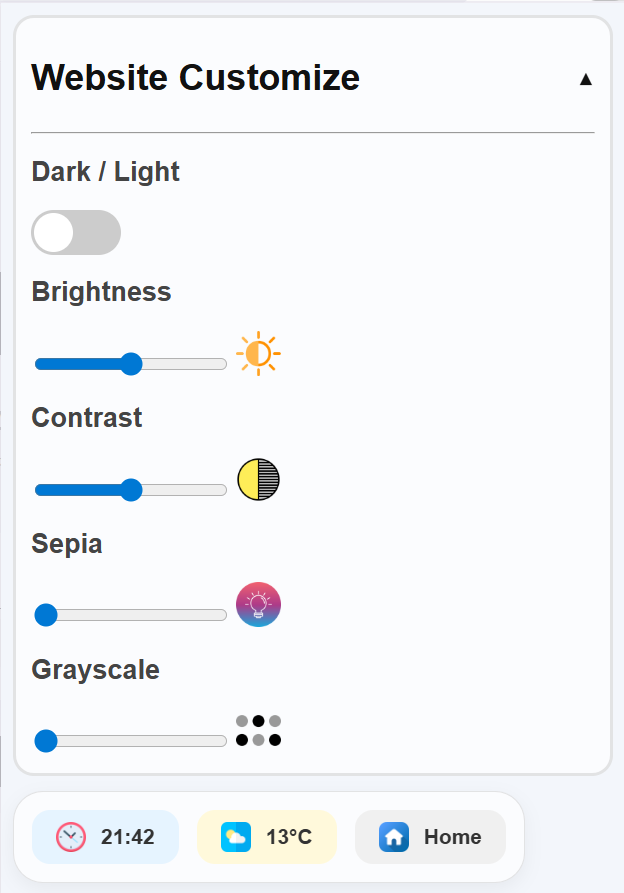
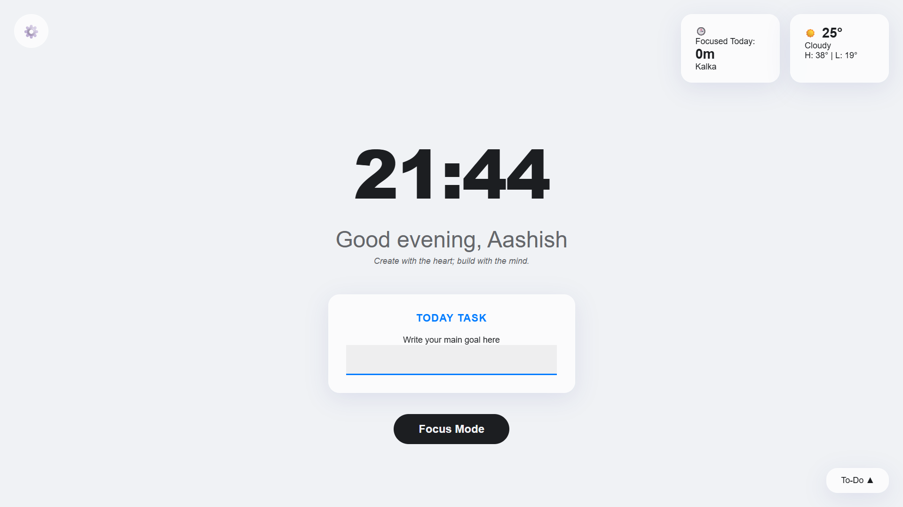
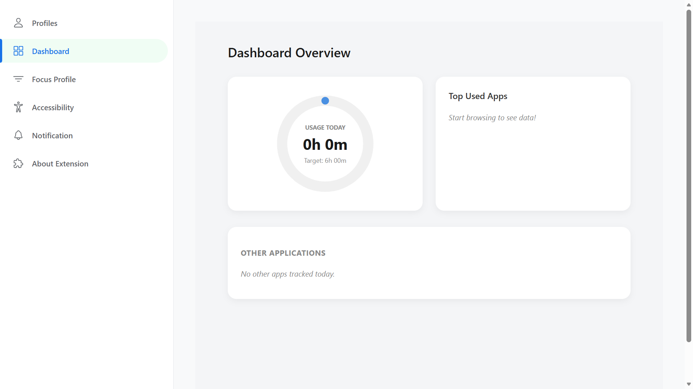

# 🚀 Focus Extension

> A Chrome extension designed to improve **digital wellbeing, reduce distractions, and enhance productivity** through a clean UI and smart tracking tools.

---

## 📌 Overview

Focus Extension is a hybrid Chrome extension built using **Vanilla JavaScript and React**.
It helps users build better browsing habits by combining **focus tracking, customization, and digital wellbeing features** in a single interface.

---

## ✨ Key Features

### 🌙 Digital Wellbeing

* Apply **dark mode** on websites that don’t support it
* Adjust **brightness and contrast** for better visual comfort
* Reduce eye strain during long browsing sessions

---

### 📊 Focus Tracking

* Track time spent on different websites
* Monitor most visited pages
* Analyze browsing patterns and usage behavior

---

### 🧠 Personalized Dashboard

* Clean and distraction-free homepage
* Displays:
    * Focus time
    * Weather updates
* Designed to promote mindful usage

---

### 👤 Profile Customization

* Update user name
* Personalize settings for a tailored experience

---

### 📝 Productivity Tools

* Built-in **to-do list** for daily planning
* Workspace-based **site blocking** to avoid distractions
* Notifications to maintain consistent focus habits

---

## 🏗️ Architecture

* **Vanilla JavaScript** → Lightweight popup & quick actions
* **React (Vite)** → Advanced UI and dashboard
* **HashRouter** → Handles routing inside Chrome extension
* Modular and loosely coupled structure

---

## 📁 Project Structure

```
project-root/
│
├── public/                 # Vanilla JS (extension core)
│   ├── background/
│   ├── popup/
│   ├── focusmode/
│   ├── homepage/
│   └── manifest.json
│
├── src/                    # React (UI layer)
│   ├── components/         # reusable UI
│   ├── panels/              # main screens
│   │   ├── FocusOnDashboard/
│   │   ├── Profile/
│   │   ├── Accessibility/
│   │   ├── Notifications/
│   │   └── About/
│   │
│   ├── layouts/            # layout wrappers
│   │   ├── MainLayout.jsx
│   │   ├── Sidebar.jsx
│   │   └── SettingsLayout.jsx
│   │
│   ├── assets/             # images, icons
│   │
│   ├── App.jsx
│   ├── main.jsx
│   └── index.css
│
└── dist/                   # build output
```

---

## 📦 Installation

1. Download the latest release ZIP
2. Extract the ZIP file
3. Open Chrome → `chrome://extensions`
4. Enable **Developer Mode**
5. Click **Load unpacked**
6. Select the extracted folder

---

## 🚀 Usage

* Click the extension icon from the browser toolbar
* Use the popup for quick actions
* Open the dashboard for:
* Focus tracking
* Settings
* Personalization

---

## 📸 Extension Preview

<table align="center">
  <tr>
    <td align="center">
      <br/>
      <b>Toolbar</b>
    </td>
    <td align="center">
      <br/>
      <b>Home</b>
    </td>
    <td align="center">
      <br/>
      <b>Dashboard</b>
    </td>
  </tr>
</table>
---

## 📈 Future Improvements

* Advanced analytics dashboard
* Cloud sync for user data
* Chrome Web Store deployment
* UI/UX enhancements

---

## 📄 License

MIT License
